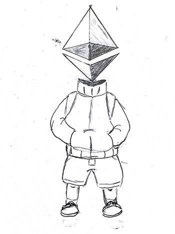

# All About Solidity

  

**All About Solidity** is an article serie that covers most of the core feature, syntax and semantics of Solidity, the smart contract programming language for Ethereum or any EVM based blockchains.

You will find code snippets and analogies that will help you understand and improve your Solidity programming skills.

**Enjoy the reading!**

> :construction: _I am currently undergoing a re-write of the content of each articles, with **cleaner table of contents**, so to make it easier to jump to relevant sections.
> You can still read them and browse their draft content with notes under the /[articles](./articles/) folder_

## Full List

**All About...**

|   	|   	|   	|
|:---	|:---	|:---	|
| [`address`](./articles/Addresses.md)  	| [cryptographic functions](./articles/Cryptographic-functions.md)  	| [`mapping`](./articles/Mappings.md)  	|
| [arrays](./Arrays.md)  	| [Data Location (`storage`, `memory`, `calldata`)](./articles/Data-Locations.md)  	| [`modifier`](./articles/Modifiers.md)  	|
| [assembly](./Assembly.md)  	| [`enum`](./articles/Enums.md)  	| [numbers](./articles/Numbers.md)  	|
| [blocks & transaction properties](./articles/Blocks-Txs.md)  	| [error handling](./articles/Error-Handling.md)  	| [`string`](./articles/Strings.md)  	|
| [`bool`](./articles/Boolean.md)  	| [ether units](./articles/Ether-Units.md)  	| [style](./articles/Style.md)  	|
| [`bytes`](./Bytes.md)  	| [`event`](./articles/Events.md)  	| [tuples](./articles/Tuples.md/Tuples.md)  	|
| [comments](./Comments.md)  	| [`function`](./articles/Functions.md)  	| [`struct`](./articles/Structs.md)  	|
| [compiler](./articles/Compiler.md)  	| [inheritance](./articles/Inheritance.md)  	| [variables (in general)](./articles/Variables.md)  	|
| [`constructor`](./articles/Constructors.md)  	| [`interface`](./articles/Interfaces.md)  	|   	|
| [control flow](./articles/Control-Flow.md)  	| [`library`(librarie contracts)](./articles/Libraries.md)  	|   	|